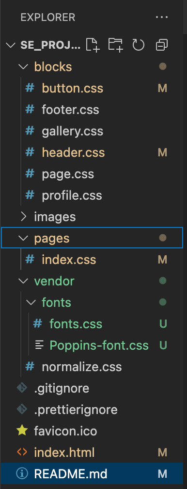

# Project 3: Spots

### Overview

- Project Description
- Functionality
- Technologies Used in the Project
- Video Page Overview

**Project Description**

Spots is a responsive social media platform designed for sharing favorite places in the world and special moments. The platform allows users to upload photos and users can interact by liking the photos of others.

**Functionality**

- User profile: can display user photo, name and bio.
- Photo Gallery: lets user upload photos and be display in a responsive grid layout.
- Interactive: pretty user friendly, allowing users to like photos, edit their bio (photo, name, bio), uploading new photos to their page.
- Responsive: this site adapts to desktops, tablets and phones.

**Technologies Used in the Project**

-HMTL5
-CSS3
-BEM for CSS

-Google Fonts

**Video Link-Google Drive**
